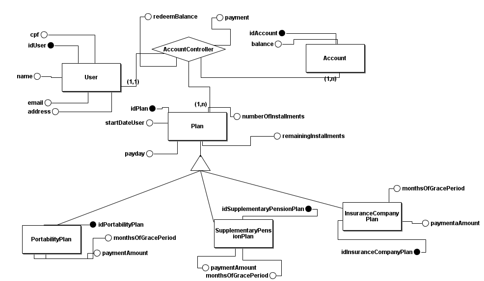
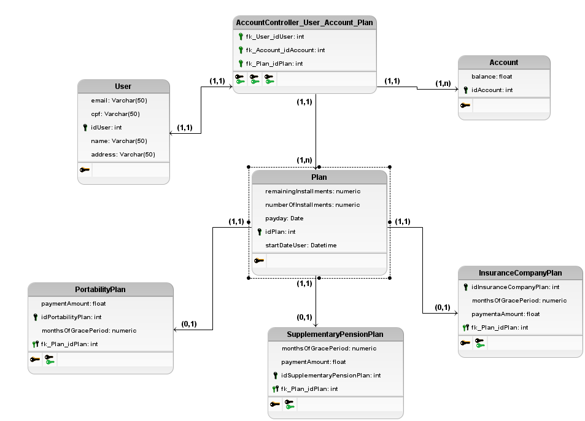

# Sistema para previdência privada

## Descrição

Uma breve descrição sobre o sistema:

Este sistema deve realizar o cadastro de novos clientes podendo estar ou não vinculado a planos de beneficios da previdência,
dentre os planos de portabilidade, previdência complementar e sociedade seguradora. O cliente pode estar vinculado em um ou mais
planos da previdência.

O cliente vinculado a um ou mais plano, pode ser um contribuinte ou seja ele esta ativo no plano ou estar na fase em que passou o tempo
carência e o cliente esta recebendo o seu beneficio.
Os clientes podem realizar o resgate parcial, sendo este 20% do valor a cada 2 anos, para realizar o resgate deve preencher um formulário,
assim este valor será liberado em até 30 dias.
Se o cliente cumprir o tempo de carência do plano, ele pode escolher por receber este valor durante os próximos meses, no caso, parcelas
mensais ajustaveis durante o periodo, não sendo necessário cancelar.

Caso um cliente deseje realizar o resgate total, isso terá um caráter irrevogável, implicando no cancelamento do plano de inscrição
com isso o cliente deverá esperar 36 meses sendo esses o tempo de carência para realizar o resgate de acordo com o plano vinculado.

### Requisitos Funcionais do Sistema

* RF01 Realizar cadastro de clientes no sistema.
* RF02 O cliente pode alterar seus dados.
* RF03 O cliente pode vicular-se a planos de previdência, sendo eles portabilidade, complementar e sociedade seguradora.
* RF04 O cliente pode gerar os boletos de pagamento.
* RF05 O cliente pode realizar o resgate do valor em conta.
* RF06 O cliente pode realizar o resgate parcial na fase contributiva.
* RF07 O cliente pode realizar o resgate total dado o prazo de carência, podendo ou não desligar-se.
* RF08 O cliente pode realizar cancelamento do plano, assim deve ele esperar o prazo de carência caso não tenha cumprido.
* RF09 O plano deve conter um valor total.
* RF10 O plano deve conter o número de parcelas.
* RF11 O plano contém uma data de entradao.
* RF12 Data de pagamento do plano pelo cliente.
* RF13 O plano deve conter o prazo de carência
* RF14 Sistema de envio de email para o cliente, lembrando data de pagamento.

### Requistos não Funcionais do Sistema

### Modelo conceitual

### Modelo relacional

### SQL
<a href="codeSql.sql" >go to code</a>

### Tecnologias utilizadas
#### Implementação Hibernate + Mysql

<a href="https://github.com/matheusfrancisco/prev-stock-info/tree/master/solution-hibernate-mysql">Implementação hibernate</a>

#### Implmentação Nodejs + Mysql

<a href="https://github.com/matheusfrancisco/prev-stock-info/tree/master/solution-1/backend">Implementação nodejs + mysql</a>

